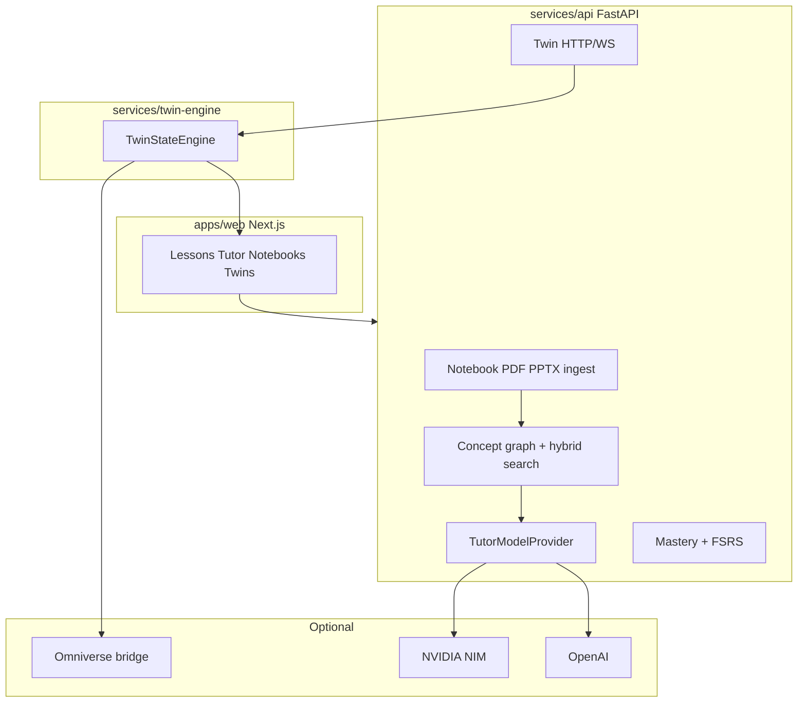

# Modality Twin Academy

A **digital-twin technical learning platform** for the NVIDIA DLI course **Building Multimodal AI Applications** (this repository’s notebooks). It is not a PDF chatbot and not an LMS clone.

The loop is:

**Learn → Predict → Experiment → Observe → Explain → Diagnose → Practice → Prove mastery**

> **Which API do you want?** Open **Settings**. Default is offline **Demo**. Optional tutor engines: **OpenAI**, **NVIDIA NIM**, **Hugging Face**. Optional voice: ElevenLabs / Sarvam / OpenAI Realtime. Optional research: Perplexity. Nothing silent-fails over to another vendor.

## What this course actually is

Notebooks under [`course-materials/`](course-materials):

| Lab | Topic |
| --- | --- |
| 00 | JupyterLab / GPU reset |
| 01a | RGB + LiDAR, XYZA math, early/late fusion (Omniverse SDG) |
| 01b | Audio spectrograms, CT/NIfTI, U-Net |
| 02a | Colored cubes; concat vs matmul intermediate fusion |
| 02b | CLIP-style contrastive pre-training (image ↔ Sobel outline) |
| 03a | Cross-modal projection into a frozen image model |
| 03b | OCR / unstructured / NV-YOLOX PDF pipelines |
| 04a | NVIDIA VSS summarization + CA-RAG |
| 04b | Vector-RAG vs Graph-RAG (Neo4j) |
| 05 | **CILP** assessment — Contrastive Image LiDAR Pre-training |

This clone did **not** include PDFs, datasets, `utils.py`, or an Omniverse Kit app. Parsers will ingest extra PDF/PPTX if you add them later. See [`docs/source-inventory.md`](docs/source-inventory.md).

## Five-minute local launch (no API keys, no GPU)

```bash
python3 -m venv .venv && source .venv/bin/activate
pip install -r services/api/requirements.txt
./scripts/dev-api.sh          # terminal 1 — http://127.0.0.1:8000
cd apps/web && npm install && npm run dev   # terminal 2 — http://127.0.0.1:3000
```

Or:

```bash
docker compose up --build
```

Open http://localhost:3000 — take the diagnostic, run the fusion twin, inspect a notebook cell, ask the tutor.

## Architecture



## Evidence model

| Badge | Meaning |
| --- | --- |
| 🔵 COURSE SOURCE | In the NVIDIA notebooks/slides |
| EXPECTED RESULT | Notebook says it should happen; not proven by stored outputs here |
| 🟣 SIMULATION | TwinStateEngine |
| 🟢 ACTUAL RUN | Imported file/telemetry |
| TUTOR INTERPRETATION | Model text derived from evidence |
| 🟣 EXTERNAL RESEARCH | Perplexity / web — cannot overwrite course definitions |

## Digital twins (web)

LiDAR geometry · Fusion lab · Modality explorer · Contrastive space · Projection · OCR pipeline · VSS CA-RAG · Graph-RAG · CILP arena

Canonical state lives in `services/twin-engine`. Omniverse is optional (`docs/OMNIVERSE_INTEGRATION.md`).

## Testing

```bash
PYTHONPATH=services/api:services/twin-engine pytest -q
cd apps/web && npm test
```

## Deployment

- **Local:** Docker Compose
- **Web:** Vercel (`deploy/vercel`) talking to the API
- **Burst API:** Modal (`deploy/modal`) — not locked in
- **NVIDIA:** NIM / NVCF / Omniverse scaffolding in `deploy/nvidia`

## Commercial note

The engine is course-pack based. NVIDIA multimodal is the flagship pack, not a hardcoded PDF bot. SSO/billing are architected, not implemented.
